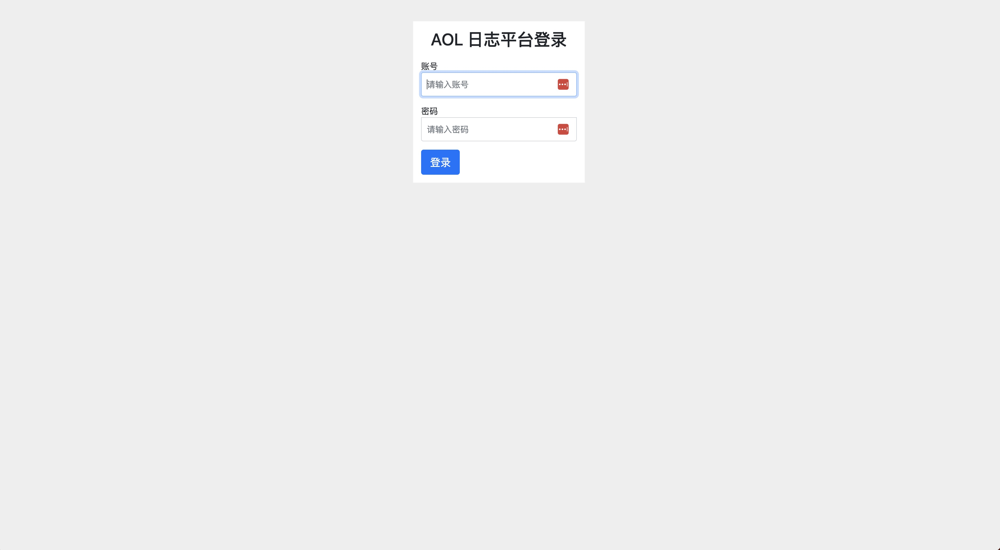
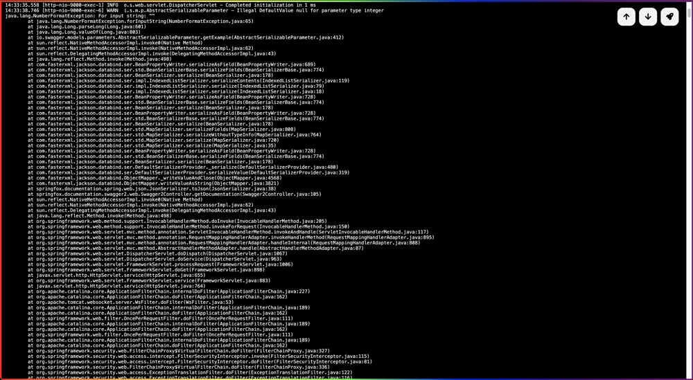
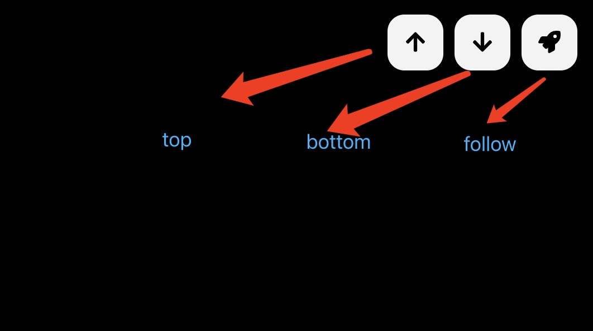

# Introduction
Allens online log is a lightweight springboot online log viewing component, you can use it to view logs in a test production environment. Provides simple authentication and log viewing functions. Hope you like it.


# How to install this component ?

1. Pom file import this dependency.

```xml
<dependency>
    <groupId>com.allens</groupId>
    <artifactId>allens-online-log</artifactId>
    <version>1.0-SNAPSHOT</version>
</dependency>
```

2. Add the annotation `@AllensOnlineLog` to the main class or other configuration class.

```java
@AllensOnlineLog
@Slf4j
public class ApplicationStarter {
}
```

3. Ignore authentication routing

① If you use the SpringSecurity component, you can add the following configuration to the security configuration class.
```java
http.authorizeRequests().and().csrf().disable()
        .antMatchers("/log/**")
        .anonymous();
```

② If you use the default springboot interceptor, you can add the following configuration to the interceptor configuration class.
```java
@Configuration
public class MyInterceptorConfig implements WebMvcConfigurer {

    @Override
    public void addInterceptors(InterceptorRegistry registry) {
        registry.addInterceptor(new MyInterceptor())
                .excludePathPatterns("/log/**"); // 忽略指定路由
    }
}
```

③ If you use the other security component, you can ignore the routing `/log/**`. that's all.

4. Configure the log path in the `application.properties` file.

```properties
logging:
  log-home: /var/logs/efficient-notes
  online:
    username: admin                                    # default username: admin
    password: admin                                    # default password: admin
    title: 'Efficient Notes Logs'                      # default title: Efficient Notes Logs
    log-file: ${logging.log-home}/efficient-note.log   # your log file path
  config: classpath:logback-spring.xml
```

5. Visit the log page
```java
http://localhost:${your application port}/log/
```


After entering the correct username and password, you can view the log information.



operation log


